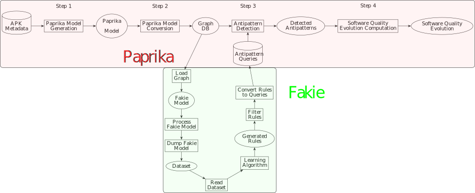

# Fakie

[](https://travis-ci.org/alexandre-clement/fakie)
[](https://codecov.io/gh/alexandre-clement/fakie)

Mining Mobile Apps to Learn Design Patterns and Code Smells.  
Fakie is a tool to automatically generate the Antipattern Queries from the Graph DB.
# Table of contents
*   [Getting Started](#getting-started)
*   [Usage](#usage)
*   [Code Smells](#code-smells-file)
*   [Overview](#overview)
*   [Development](#development)
*   [Get involved](#get-involved)
*   [Troubleshooting](#troubleshooting)

## Getting Started

### Build with [Maven](https://maven.apache.org/) - Dependency Management

* Compile `mvn clean compile`
* Running the test `mvn clean install`
* Create jar `mvn clean package`
* Execute `mvn exec:java -Dexec.args="analyse query generate"`


## Running Fakie Phases

* [**Analyse**](#analyse) : Use Paprika to analyse android apk and generate a database.
* [**Query**](#query) : Use the queries available in Paprika to detect the code smells in the database.
* [**Generate**](#generate) : Generate tules from identified code smell
    * [**Load Graph**](#graph-loader) : Load the Paprika database as a graph
    * [**Apply Learning Algorithm**](#learning-algorithm) : Apply a learning algorithm on the graph to generate rules
    * [**Export Rules as Queries**](#query-exporter) : Export the generated rules as queries for Paprika


## Help and Version

```
 ███████╗ █████╗ ██╗  ██╗██╗███████╗
 ██╔════╝██╔══██╗██║ ██╔╝██║██╔════╝
 █████╗  ███████║█████╔╝ ██║█████╗
 ██╔══╝  ██╔══██║██╔═██╗ ██║██╔══╝
 ██║     ██║  ██║██║  ██╗██║███████╗
 ╚═╝     ╚═╝  ╚═╝╚═╝  ╚═╝╚═╝╚══════╝

Usage: fakie [-hV] [COMMAND]

Description:
  Mining Mobile Apps to Learn Design Patterns and Code Smells.

Options:
  -h, --help      Show this help message and exit.
  -V, --version   Print version information and exit.

Commands:
  analyse     Run Paprika analyse on given folder
  query       Run Paprika query on the given db
  load-neo4j  Import Android applications from a Neo4j database.
  generate    Macro command to load a Neo4j database and then use the FPGrowth
                algorithm to generate Cypher queries
 ```
 
## Analyse

Use Paprika to analyse android apk and generate a database.

```
Usage: fakie analyse [-hV] [-a=<androidJars>] [-db=<db>] [-f=<apk>] [-i=<info>]
                     [COMMAND]

Description:
  Run Paprika analyse on given folder

Options:
  -a, --android=<androidJars>
                             Path to the android platform jars
                               Default: android_platform
  -db, --database=<db>       Path to the info Paprika db
  -f, --apk-folder=<apk>     Path to the apk folder
                               Default: apk
  -h, --help                 Show this help message and exit.
  -i, --info-apk=<info>      Path to the info apk file
                               Default: info.csv
  -V, --version              Print version information and exit.

Commands:
  query       Run Paprika query on the given db
  load-neo4j  Import Android applications from a Neo4j database.
  generate    Macro command to load a Neo4j database and then use the FPGrowth
                algorithm to generate Cypher queries
```

### File Structure

By default, your file structure should look like this
```
root
│   info.csv   
│
└───android_platform
│   │   android-3
│   │   │   android.jar
│   │   android-4
│   │   │   android.jar
│   │   ...
│   
└───apk
    │   org.torproject.android.apk
    │   org.wikipedia.apk
    │   ...
```
But you can specify each of this path by using the options of the `analyse` command.  
You can find many Android platforms in [this Github repository](https://github.com/Sable/android-platforms). 


### Info.csv

The file `info.csv` contains the name, the main package and the apk name of the android application you want to analyse.  
Here is an example with 4 applications :

```csv
"Google IO Sched","com.google.samples.apps.iosched","iosched.apk"
"AdAway","org.adaway","org.adaway_53.apk"
"ADW.Launcher","org.adw.launcher","org.adw.launcher_34.apk"
"Wikipedia","org.wikipedia","org.wikipedia_109.apk"
```

Note : the csv must not have a header

### Examples

* `fakie analyse`
* `fakie analyse -a "android_platform_master" -db "output" -f . -i "info/info.csv"`

## Query

Use the queries available in Paprika to detect the code smells in the database.

```
Usage: fakie query [-hV] [-db=<db>] [-s=<suffix>] [COMMAND]

Description:
  Run Paprika query on the given db

Options:
  -db, --database=<db>       Path to the info Paprika db
  -h, --help                 Show this help message and exit.
  -s, --suffix=<suffix>      Suffix for the csv filename
  -V, --version              Print version information and exit.

Commands:
  load-neo4j  Import Android applications from a Neo4j database.
  generate    Macro command to load a Neo4j database and then use the FPGrowth
                algorithm to generate Cypher queries
```

### File Structure

By default, your file structure should look like this
```
root
└───db
│   │   ...
└───codesmell   <-- this folder will be generated if it does not exist
│   │   ...     <-- the detected code smells goes here
```
But you can specify each of this path by using the options of the `query` command.

### Examples

* `fakie query`
* `fakie query -db "output" -s "output-codesmell/"`  
:warning: You have to put a `/` at the end of your suffix if you want it to be a folder. This behavior comes from Paprika.

## Generate

Generate a new set of queries for Paprika from the database and the code smells detected by Paprika

```
Usage: fakie generate [-hV] [-db=<db>] [-f=<codesmell>] [-n=<n>] [-o=<output>]
                      [-s=<support>]

Description:
  Macro command to load a Neo4j database and then use the FPGrowth algorithm to
generate Cypher queries

Options:
  -db, --database=<db>       Path to the Neo4j database
  -f, --file=<codesmell>     Path to the file containing the code smells in the
                               database
  -h, --help                 Show this help message and exit.
  -n, --nb-rules=<n>         Number of rules to find
                               Default: 10000
  -o, --output=<output>      Destination folder for the generated queries
  -s, --min-support=<support>
                             Minimum support bound
                               Default: 0.1
  -V, --version              Print version information and exit.
```


### File Structure

By default, your file structure should look like this
```
root
└───db
│   │   ...
└───codesmell    <--- every csv in this folder will be imported as a code smell file
│   │   BLOB.csv
│   │   LM.csv
│   │   ...
└───queries      <-- this folder will be generated if it does not exist
│   └───cypher   <-- this folder will be generated if it does not exist
│   │   │   ...  <-- the generated queries goes here
```
But you can specify each of this path by using the options of the `query` command.

### Examples

* `fakie generate`
* `fakie generate -db "output" -n 50000 -s 0.5 -f "output-codesmell" -o "output-queries"`


## Graph loader

Load the Paprika database as a graph

* Neo4j `load-neo4j` : Load graph from a Neo4j database

```
Usage: fakie load-neo4j [-hV] [-db=<db>] [COMMAND]

Description:
  Import Android applications from a Neo4j database.

Options:
  -db, --database=<db>       Path to the Neo4j database
  -h, --help                 Show this help message and exit.
  -V, --version              Print version information and exit.

Commands:
  fpgrowth  Use the FPGrowth algorithm on the dataset
  apriori   Use the Apriori algorithm on the dataset
```

## Learning Algorithm

Apply a learning algorithm on the graph to generate rules

* FPGrowth `fpgrowth` : Use the FPGrowth algorithm on the dataset
```
Usage: fakie load-neo4j fpgrowth [-hV] [-f=<codesmell>] [-n=<n>] [-s=<support>]
                                 [COMMAND]

Description:
  Use the FPGrowth algorithm on the dataset

Options:
  -f, --file=<codesmell>   Path to the file containing the code smells in the
                             database
  -h, --help               Show this help message and exit.
  -n, --nb-rules=<n>       Number of rules to find
                             Default: 10000
  -s, --min-support=<support>
                           Minimum support bound
                             Default: 0.1
  -V, --version            Print version information and exit.

Commands:
  cypher  Export the generated rules in the Cypher query language
```

* Apriori `apriori` : Use the Apriori algorithm on the dataset :warning: NOT RECOMMENDED : VERY SLOW :snail:
```
Usage: fakie load-neo4j apriori [-hV] [-f=<codesmell>] [-n=<n>] [-s=<support>]
                                [COMMAND]

Description:
  Use the Apriori algorithm on the dataset

Options:
  -f, --file=<codesmell>   Path to the file containing the code smells in the
                             database
  -h, --help               Show this help message and exit.
  -n, --nb-rules=<n>       Number of rules to find
                             Default: 10000
  -s, --min-support=<support>
                           Minimum support bound
                             Default: 0.1
  -V, --version            Print version information and exit.

Commands:
  cypher  Export the generated rules in the Cypher query language
```
        
## Query Exporter

Export the generated rules as queries for Paprika

* Cypher `cypher` : Export the generated rules in the Cypher query language
```
Usage: fakie load-neo4j apriori cypher [-hV] [-o=<output>]

Description:
  Export the generated rules in the Cypher query language

Options:
  -h, --help              Show this help message and exit.
  -o, --output=<output>   Destination folder for the generated queries
  -V, --version           Print version information and exit.
```

## Code Smells File

In order to work properly, the learning algorithm needs an input file containing the code smell present in the targeted project.
This file should look like this :

### CSV (Default Paprika output for code smell detection)

The code smell name should appear in the filename (ex: `BLOB.csv`)

```csv
app_key,lack_of_cohesion_in_methods,number_of_methods,number_of_attributes,full_name,fuzzy_value
Aard,1837,71,29,aarddict.android.ArticleViewActivity,1
Aard,150,20,10,aarddict.android.LookupActivity,0.245
Aard,116,25,17,aarddict.android.DictionaryService,1
```

### Json

```json
{
  "codeSmells": [
    {
      "labels": ["Class"],
      "properties": {"name": "org.torproject.android.service.TorService"},
      "name": "God Class"
    },
    {
      "labels": ["Class"],
      "properties": {"name": "org.torproject.android.OrbotMainActivity"},
      "name": "God Class"
    },
    {
      "labels": ["Class"],
      "properties": {"name": "org.torproject.android.Prefs"},
      "name": "God Class"
    },
    {
      "labels": ["Class"],
      "properties": {"name": "org.torproject.android.settings.TorifiedApp"},
      "name": "God Class"
    }
  ]
}
```

Note : Fakie tries to find the vertex that best fit the given labels and properties. If Fakie finds too many matches for a given instance, it will silently ignore it.

## Overview



## Development

### Embedded Paprika
* Run Paprika Analyse :heavy_check_mark:
* Run Paprika Query :heavy_check_mark:
    * Run all fuzzy queries :heavy_check_mark:
    * Run all queries :heavy_check_mark:
* Parse Paprika Query result :heavy_check_mark:

### Load Graph
* Neo4j :heavy_check_mark:

### Process Fakie Model
* Add code smell to the Fakie model :heavy_check_mark:
* Convert vertices numeric properties to nominal :heavy_check_mark:
* Convert vertices numeric properties to boolean :heavy_check_mark:
* Convert vertices arrays properties to nominal :heavy_check_mark:
* Convert vertices nominal properties to boolean :heavy_check_mark:
* Removing properties with a single value :heavy_check_mark:
* Process only vertices which contains a code smell :heavy_check_mark:
* Convert edges properties values to boolean :heavy_check_mark:
* Resolution of collision among properties :x:

Note: Converting numeric to nominal and then nominal to boolean is not equals to converting numeric to boolean.
The conversion from numeric to boolean uses a threshold system in order to accelerate the learning phase.

### Dump Fakie Model
* Dump Fakie Model to an ARFF dataset :heavy_check_mark:

### Read Dataset
* Read an ARFF dataset :heavy_check_mark:

### Data Mining Algorithm
* Implement FPGrowth algorithm to infer associations rules among properties :heavy_check_mark:
* Implement Apriori algorithm to infer associations rules among properties :heavy_check_mark:

### Filter Rules
* Filter the rules to keep only those that identify a smell code :heavy_check_mark:
* Filter the rules to keep only the many to one rules :heavy_check_mark:
* Remove consequences in rules that are not a code smell :heavy_check_mark:
* Filter rules with the same support but a different the amount of premises :heavy_check_mark:

### Export Rules to Queries
* Export the rules to Cypher :heavy_check_mark:
* Convert Fakie rules to allow a reuse by Paprika :heavy_check_mark:

## Get Involved

### Add your own attribute generation to Fakie

Generating attribute in Fakie is done by a Processor which takes a Graph in input and return a Graph (it can be the same or a new one).

```java
package com.fakie.model.processor;

import com.fakie.model.graph.Graph;
import com.fakie.utils.exceptions.FakieException;

public interface Processor {
    Graph process(Graph graph) throws FakieException;
}
```

So if you want, for instance, generate a new attribute in the classes of the graph which contains the sum of the number of instructions in the methods of each class.

* First, you create a new Processor which implements the Processor interface.

```java
package com.fakie.model.processor;

import com.fakie.model.graph.Graph;
import com.fakie.utils.exceptions.FakieException;

public class ComputeNumberOfInstructionsInMethods implements Processor {
    @Override
    public Graph process(Graph graph) throws FakieException {
        return graph;
    }
}
```

* Then you iterate over the class in the graph

```java
package com.fakie.model.processor;

import com.fakie.model.graph.Graph;
import com.fakie.model.graph.Vertex;
import com.fakie.utils.exceptions.FakieException;
import com.fakie.utils.paprika.Label;

public class ComputeNumberOfInstructionsInMethods implements Processor {
    @Override
    public Graph process(Graph graph) throws FakieException {
        for (Vertex cls : graph.findVerticesByLabel(Label.CLASS.toString())) {
            processClass(cls);
        }
        return graph;
    }

    private void processClass(Vertex cls) {
        
    }
}
```

* For each class, you iterate over the methods to get their number of instructions, sum them and add this sum to the class as a property.

```java
package com.fakie.model.processor;

import com.fakie.model.graph.Edge;
import com.fakie.model.graph.Graph;
import com.fakie.model.graph.Vertex;
import com.fakie.utils.exceptions.FakieException;
import com.fakie.utils.paprika.Key;
import com.fakie.utils.paprika.Label;
import com.fakie.utils.paprika.Relationship;

public class ComputeNumberOfInstructionsInMethods implements Processor {
    @Override
    public Graph process(Graph graph) throws FakieException {
        for (Vertex cls : graph.findVerticesByLabel(Label.CLASS.toString())) {
            processClass(cls);
        }
        return graph;
    }

    private void processClass(Vertex cls) {
        int totalNumberOfInstructions = 0;
        for (Edge classOwnsMethod : cls.outputEdges(Relationship.CLASS_OWNS_METHOD.toString())) {
            Vertex method = classOwnsMethod.getDestination();
            Object numberOfInstructions = method.getProperty(Key.NUMBER_OF_INSTRUCTIONS.toString());
            totalNumberOfInstructions += Integer.valueOf(numberOfInstructions.toString());
        }
        cls.setProperty("NumberOfInstructionsInMethods", totalNumberOfInstructions);
    }
}
```

* Finally, add your processor to the orchestrator

```java
package com.fakie.learning.association;

public class AssociationOrchestrator {
    // ...
    private List<Rule> generateRules(CodeSmells codeSmells, Graph graph) throws FakieException {
        useGraph(graph);
        useProcessors(
                new ConvertLabelsToProperties(),
                new ConvertArraysToNominal(),
                new ApplyCodeSmellOnGraph(codeSmells),
                new ComputeNumberOfInstructionsInMethods(), // Here goes your processor
                new MethodWhiteList(),
                new OverriddenMethods(),
                new CallWhiteList(),
                new Calls(),
                new KeepOnlyVertexWithCodesmellLabel(),
                new RemoveEdges(),
                new ConvertNumericToBoolean(),
                new ProcessOnlyVerticesWithACodeSmell(),
                new ConvertNominalToBoolean(),
                new KeepOnlyBooleanProperties(),
                new SequentialAssociation()
        );
        applyProcessors();
        Path datasetPath = dumpGraph();
        Instances dataset = readDataset(datasetPath);
        Association association = new Association(dataset, associator, associator);
        List<Rule> rules = association.generateRules();
        logGeneratedRules(rules);
        List<Rule> filtered = applyFilters(rules);
        logFilteredRules(filtered);
        return filtered;
    }
}
```

Note: The processors are executed sequentially so the order matter. In our example, if you compute the number of instructions in methods after applying the method white list, the result might be wrong because the non white listed methods has been deleted.

### Add your own rule selection to Fakie

Rule selection in Fakie is done by a Filter which takes a list of Rule in input and return a list of Rule (it can be the same or a new one).

```java
package com.fakie.learning.filter;

import com.fakie.learning.LearningException;
import com.fakie.learning.Rule;

import java.util.List;

public interface Filter {
    List<Rule> filter(List<Rule> rules) throws LearningException;
}
```

So if you want, for instance, select only the rule with the product confidence * support > 0.5

* First, you create a new Filter which implements the Filter interface.

```java
package com.fakie.learning.filter;

import com.fakie.learning.LearningException;
import com.fakie.learning.Rule;

import java.util.List;

public class SupportTimesConfidenceTreshold implements Filter {
    @Override
    public List<Rule> filter(List<Rule> rules) throws LearningException {
        return rules;
    }
}
```

* Then you remove from the list all the rule with more than one premise

```java
package com.fakie.learning.filter;

import com.fakie.learning.Rule;
import com.fakie.utils.expression.Expression;

import java.util.ArrayList;
import java.util.List;

public class SupportTimesConfidenceTreshold implements Filter {
    @Override
    public List<Rule> filter(List<Rule> rules) {
        List<Rule> filtered = new ArrayList<>();
        for (Rule rule : rules) {
          if (rule.getSupport() * rule.getConfidence() > 0.5) {
            filtered.add(rule);
          }
        }
        return filtered;
    }
}
```

* Finally, add your filter to the orchestrator

```java
package com.fakie.learning.association;

public class AssociationOrchestrator {
    // ...
    private List<Rule> generateRules(CodeSmells codeSmells, Graph graph) throws FakieException {
        useGraph(graph);
        useProcessors(
          // ...
        );
        useFilters(
          new SupportTimesConfidenceTreshold() // Here goes your filter
        );
        applyProcessors();
        Path datasetPath = dumpGraph();
        Instances dataset = readDataset(datasetPath);
        Association association = new Association(dataset, associator, associator);
        List<Rule> rules = association.generateRules();
        logGeneratedRules(rules);
        List<Rule> filtered = applyFilters(rules);
        logFilteredRules(filtered);
        return filtered;
    }
}
```

## Troubleshooting

Fakie is still in development.  
Found a bug? We'd love to know about it!  
Please report all issues on the github issue tracker.
